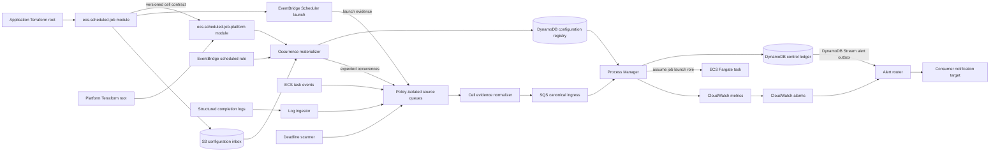
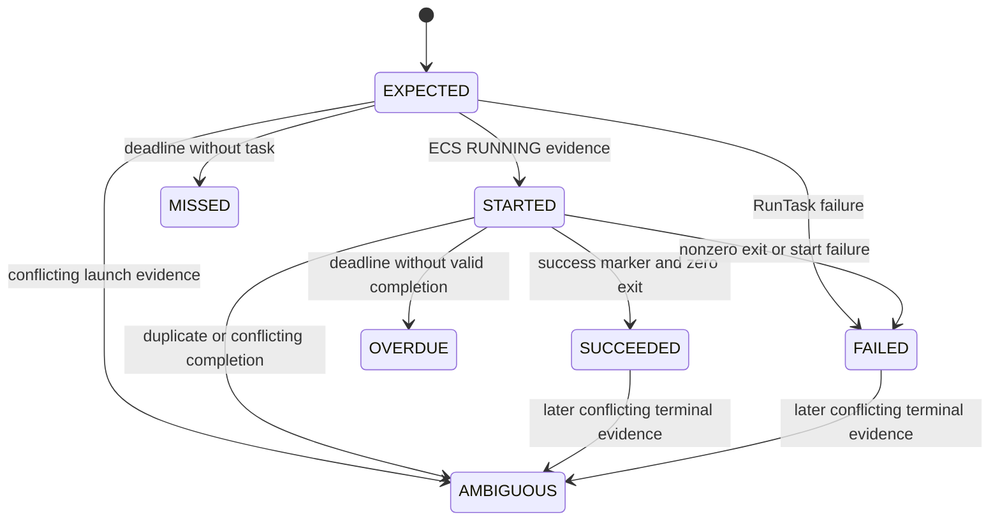
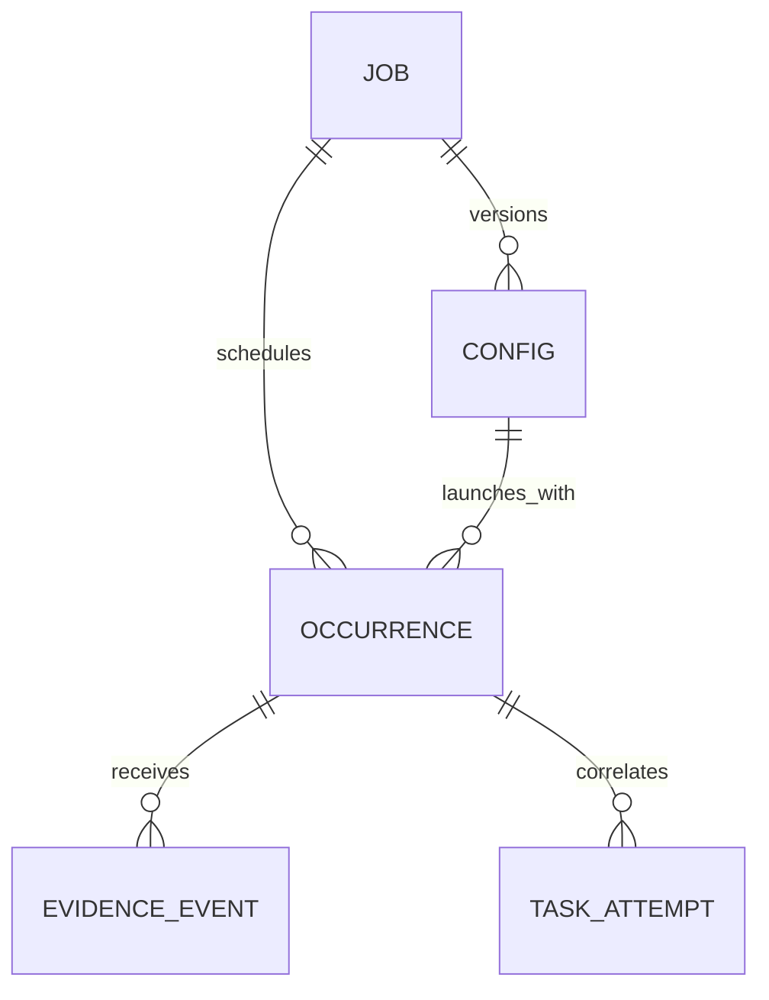

# Architecture Spine — ECS Scheduled Jobs Platform Service

## Design Paradigm

**Account-local Cell-Based Architecture with an Event-Driven Process Manager.** Each workload AWS Account and Region contains one Platform Cell. Terraform separates shared Cell resources from per-job resources. A single Process Manager owns occurrence-state mutation; all other runtime components emit versioned evidence.



## Invariants & Rules

### AD-1 — Account-local Platform Cells [ADOPTED]

- **Binds:** all runtime and deployment areas
- **Prevents:** cross-account blast radius, central runtime credentials, and hidden regional dependencies
- **Rule:** Deploy one independent Platform Cell per workload AWS Account and Region. Schedules, ingress, processors, ledger, metrics, alarms, roles, logs, and task definitions remain account- and Region-local. Only code distribution and notification destinations may be centralized.

### AD-2 — Shared Cell and Per-job Ownership [ADOPTED]

- **Binds:** FR-1–FR-4, FR-25–FR-28
- **Prevents:** per-job copies of shared processors and shared resources managed from application state
- **Rule:** Platform Engineering owns the `ecs-scheduled-job-platform` module and Cell state. Application roots own `ecs-scheduled-job` instances and job state. Job modules consume the versioned Cell Contract and never create or mutate shared Cell infrastructure.

### AD-3 — Independent Expectation and Launch Clocks [ADOPTED]

- **Binds:** FR-6–FR-8, FR-15, FR-17
- **Prevents:** a missing Scheduler invocation from erasing the Expected Occurrence it was meant to launch
- **Rule:** EventBridge Scheduler emits only `LAUNCH` evidence. Independently, an Occurrence Materializer invoked by an EventBridge scheduled rule evaluates immutable job schedule contracts and emits `EXPECTED` evidence at least 24 hours ahead. Production enablement requires a verified expectation horizon beyond the configured completion window. The evaluator and Scheduler share one normalized recurring cron/rate expression, IANA time zone, explicit start anchor, activation window, disabled flexible window, and schedule-generation hash; the module rejects syntax outside the Compatibility Package grammar and one-time schedules are out of scope.

### AD-4 — Stable Occurrence Identity [ADOPTED]

- **Binds:** FR-6, FR-14–FR-18, NFR-5–NFR-9
- **Prevents:** retries, adjacent windows, and late signals from satisfying the wrong occurrence
- **Rule:** Identity version `occurrence/v1` hashes the exact UTF-8 bytes `occurrence/v1\n<job_id>\n<schedule_generation>\n<epoch_minute>` to lowercase SHA-256. `epoch_minute` is the base-10 Unix epoch minute computed from the schedule contract and from Scheduler `<aws.scheduler.scheduled-time>`; event schema versions never enter identity. `job_id` and generation grammar, byte serialization, normalization, and published test vectors live in the Compatibility Package. The Process Manager recomputes identity and rejects mismatches.

### AD-5 — Versioned Event and Configuration Contracts

- **Binds:** FR-1, FR-4–FR-8, FR-17, FR-24–FR-25
- **Prevents:** producers from inventing payloads and queued work from reading mutated launch configuration
- **Rule:** Every canonical input conforms to a Compatibility Package schema containing Cell-stamped `producer_id`, producer-unique `producer_event_id`, `event_type`, `schema_version`, `job_id`, `config_version`, `schedule_generation`, `scheduled_time`, `occurrence_id`, `emitted_at`, and typed `payload`. Producers cannot stamp identity: policy-isolated source queues accept only their exact AWS principal and event types, and the Cell normalizer derives identity from source queue ARN. The job module publishes secret-free, content-addressed CONFIG to its registered S3 prefix; the materializer validates and copies it into the registry before enablement.

### AD-6 — Single Occurrence-state Writer

- **Binds:** FR-16–FR-18, NFR-5–NFR-9
- **Prevents:** last-write-wins state corruption and incompatible transition logic
- **Rule:** Only the Process Manager mutates the runtime ledger's `OCCURRENCE`, `TASK_ATTEMPT`, and processed-`EVENT` items. Job Terraform principals have no write action on ledger or registry tables and may write only their S3 inbox prefix. The materializer alone creates verified registry snapshots; it, the log ingestor, and deadline scanner may emit evidence but may not mutate runtime state. The Process Manager rejects CONFIG whose canonical body does not match `config_version`.

### AD-7 — Occurrence State Machine [ADOPTED]

- **Binds:** FR-17–FR-18, NFR-5–NFR-9
- **Prevents:** silent duplicate completion and terminal-state overwrite
- **Rule:** The canonical states are `EXPECTED`, `STARTED`, `SUCCEEDED`, `FAILED`, `OVERDUE`, `MISSED`, and `AMBIGUOUS`. State is a deterministic reduction of immutable, deduplicated evidence, not an arrival-order transition. Launch, task, completion, deadline, replay, and late-expectation evidence must commute under the Compatibility Package transition table. A valid launch may repair a missing expectation only when CONFIG proves it and must raise a Cell-defect signal. MVP creates exactly one platform task attempt per occurrence; delivery retries reuse it. Conflicting evidence for that attempt or more than one task ARN yields `AMBIGUOUS`; no terminal result is silently overwritten.



### AD-8 — Idempotent, Job-scoped ECS Launch

- **Binds:** FR-5, FR-7–FR-8, FR-10–FR-11, FR-16–FR-17
- **Prevents:** crash-window duplicate tasks and a shared broad `ecs:RunTask` permission
- **Rule:** Before `RunTask`, a DynamoDB transaction reserves scheduled `attempt_no=0`, deterministic token, CONFIG version, launch-pending state, first-request time, and a conservative safe-retry deadline no later than one hour after first request. Retries reuse that record/token and first reconcile the original task by cluster, Cell tags, and `startedBy=occurrence_id`. Because ECS token TTL is `min(24h, resource lifetime + 1h)`, no retry/replay calls `RunTask` after the conservative deadline unless the original task is authoritatively recovered; unresolved state fails closed to `AMBIGUOUS` and requires an authorized synthetic rerun.

### AD-9 — Correlated Completion Truth [ADOPTED]

- **Binds:** FR-14, FR-16–FR-18
- **Prevents:** a success log line or zero exit code alone from declaring business success
- **Rule:** Correlate durable ECS task-state events and structured completion logs by Cell-owned task tags, exact task ARN, reserved occurrence/attempt environment values, and the task-ARN ledger index. ECS identity derives from AWS event resource/detail fields; log identity derives from AWS-generated subscription `logGroup`/`logStream` mapped to registered job/task. IDs inside application log text are assertions to compare, never authority. Early events remain orphan evidence until launch mapping arrives. `SUCCEEDED` requires one accepted marker and zero essential-container exit for attempt zero.

### AD-10 — Central Deadline Evaluation

- **Binds:** FR-8, FR-17, NFR-6–NFR-9
- **Prevents:** job-specific timeout implementations and inconsistent missing-data behavior
- **Rule:** A minute-cadence deadline scanner uses a durable watermark, rescans a bounded lookback across deadline buckets, verifies candidates against the base table, and reconciles every nonterminal item through the maximum lateness horizon; it never treats a one-time eventually consistent GSI miss as absence. It emits deduplicated `DEADLINE_REACHED` evidence, and the Process Manager decides `MISSED` versus `OVERDUE`. Maximum runtime is detection-only; the Cell never stops a task automatically in MVP.

### AD-11 — At-least-once Ingress and Replay

- **Binds:** FR-7, FR-15–FR-17, NFR-5–NFR-8
- **Prevents:** lost evidence and poison messages blocking unrelated occurrences
- **Rule:** Use encrypted SQS standard queues with Lambda partial-batch responses, `ReportBatchItemFailures`, `maxReceiveCount >= 5`, and a 14-day redrive DLQ. Queue visibility is at least six times function timeout plus batch window; validated bounds tie timeout, visibility, batch, concurrency, payload size, and redrive. Scheduler failures use a shared standard Scheduler DLQ. Evidence replay re-enters the same reducer, but launch replay obeys AD-8's conservative safe-retry deadline. A one-minute end-to-end canary and materialized horizon are fail-closed; either missing declares Cell unhealthy within five minutes.

### AD-12 — Explicit IAM Boundaries [ADOPTED]

- **Binds:** FR-10–FR-13, FR-21–FR-23, NFR-1–NFR-4
- **Prevents:** application permissions, runtime permissions, and deployment authority from collapsing into one role
- **Rule:** Keep Scheduler delivery, evidence normalizer, Process Manager, command handler, job launch, ECS task execution, application task, Terraform plan, and Terraform apply roles separate. Producers send only to their policy-isolated source queue/DLQ; only the normalizer sends canonical ingress. The Process Manager may assume only boundary-constrained launch roles under the platform role path. No role may alter its own trust, policy, boundary, OIDC provider, or protected state controls.

### AD-13 — Private Workload Networking [ADOPTED]

- **Binds:** FR-13, NFR-3
- **Prevents:** public ECS tasks and unnecessary Lambda VPC coupling
- **Rule:** Platform Lambdas run outside customer VPCs and use regional AWS APIs. ECS tasks use `awsvpc`, supplied private subnets, minimal security groups, and `assignPublicIp = DISABLED`. Consumers provide NAT or documented VPC endpoints for image pull, logs, secrets, and workload dependencies.

### AD-14 — Bounded Metrics and Enriched Alerts [ADOPTED]

- **Binds:** FR-14–FR-19, FR-27–FR-28, NFR-6–NFR-8, NFR-17
- **Prevents:** occurrence-ID metric cardinality and alerts without run context
- **Rule:** Custom metrics use only bounded `job_id`, `environment`, and `state` dimensions; never use `occurrence_id` as a metric dimension. The Process Manager atomically commits each newly accepted terminal failure with `ALERT_OUTBOX#<occurrence>#<policy>` in one DynamoDB transaction. A Stream-driven Alert Router plus reconciliation scan publishes pending outbox records and deduplicates delivery in a separate notification ledger through the retry horizon. CloudWatch alarms cover sustained health separately. Alerts include occurrence, failure plane, account, Region, Deployment Identity, and Runbook context.

### AD-15 — Terraform State and Cell Discovery [ADOPTED]

- **Binds:** FR-2–FR-4, FR-20–FR-25, NFR-10–NFR-16
- **Prevents:** cross-repository remote-state coupling and environment state overlap
- **Rule:** The Cell publishes its JSON-Schema-validated contract at `/platform/ecs-scheduled-jobs/<environment>/<region>/contract`; it includes semantic version, Cell/account/Region identity, exact resource ARNs, metric namespace, KMS reference, supported schema/config ranges, and checksum. Consumers validate identity and compatibility and never read another repository's Terraform state. Each account/environment/root uses a distinct encrypted, versioned, public-blocked S3 backend key with native `use_lockfile = true`; roles scope exact state and lock objects.

### AD-16 — Workflow-bound Delivery Authority [ADOPTED]

- **Binds:** FR-20–FR-25, NFR-1–NFR-4, NFR-10–NFR-16
- **Prevents:** untrusted code, moving workflows, or an arbitrary target account from receiving production credentials
- **Rule:** Untrusted pull requests run credential-free checks. Trusted plans use a read-only plan role. Production OIDC uses immutable GitHub repository IDs and a custom subject template that includes deployment Environment and `job_workflow_ref`; AWS trusts exact `aud` and `sub`. The reusable workflow is pinned by full commit SHA. Production generates a fresh saved plan from the deployment commit, gates a distinct apply job through a protected Environment, and applies that exact short-lived plan with a bounded apply role.

### AD-17 — Immutable Supply Chain and Compatibility Seed [ADOPTED]

- **Binds:** FR-5, FR-20, FR-24–FR-26, NFR-10–NFR-15
- **Prevents:** moving module, workflow, Action, provider, and image dependencies
- **Rule:** Pin production module and reusable-workflow sources to immutable commits, Actions to full SHAs, container images to digests, and Python dependencies. Consumer roots commit provider lock files; production runs `terraform init -lockfile=readonly`. Fargate `LATEST` and Lambda runtime patching are explicit managed-runtime exceptions: Deployment Identity records resolved platform/runtime versions, and canaries/compatibility tests gate observed AWS changes. Contract changes follow semantic versioning and migration notes.

### AD-18 — Two-phase Schedule Change and Rollback [ADOPTED]

- **Binds:** FR-6–FR-9, FR-23–FR-28, NFR-7
- **Prevents:** Scheduler/materializer generation mismatch and destructive cleanup before evidence drains
- **Rule:** Production schedule expression or time-zone changes use two applies. First disable launch and retire the old schedule generation after active occurrences drain. Then publish the new immutable generation with a future activation anchor, materialize and verify its expectation horizon, and enable Scheduler at that same anchor. Rollback disables launch first, restores a known-good Deployment Identity and compatible schemas/config, replays safe evidence, verifies scheduling/execution/logs/alarms within the job recovery-time objective, and retains data until platform recovery and Job Owner side-effect compensation are confirmed.

### AD-19 — Cell Health Is a Production Contract [ADOPTED]

- **Binds:** FR-15–FR-18, FR-27–FR-28, NFR-6–NFR-9, NFR-17
- **Prevents:** a shared control-plane failure from presenting as unrelated per-job misses or silent success
- **Rule:** Production Cell gates and alarms cover expectation-horizon freshness, Scheduler delivery/DLQ, ingress age/depth/DLQ, every Lambda's errors/throttles/concurrency/freshness, DynamoDB throttles/conditional failures, schema rejection, log-subscription delivery, ECS event ingestion, AssumeRole/`RunTask` failures, deadline lag, and Alert Router delivery. Cell-wide failures page Platform on-call once; occurrence failures notify the Job Owner. Failure-injection tests prove each path and alert within five minutes of the observable failure or deadline.

### AD-20 — Delivery and Operator Authority [ADOPTED]

- **Binds:** FR-20–FR-25, FR-27–FR-28, NFR-1–NFR-4, NFR-10–NFR-16
- **Prevents:** an architecture-conformant implementation from bypassing repository gates or giving humans workload credentials
- **Rule:** Required checks are `terraform fmt -check`, backend-free validation, module/example tests, security/IAM/policy scans, and a reviewed plan; production policy failures block, while explicitly listed non-production advisories follow the PRD rollout. Humans use a separate short-lived, approved, CloudTrail-attributed operator role for diagnosis, rerun, replay, disablement, and recovery; they never assume workload roles. Break-glass use is time-bound, independently approved, alerted, and reviewed.

### AD-21 — Per-job Reliability and Manual Rerun Contract [ADOPTED]

- **Binds:** FR-7–FR-9, FR-17, FR-27–FR-28, NFR-5–NFR-9
- **Prevents:** infrastructure launch idempotency from being mistaken for application-effect idempotency
- **Rule:** Each production job declares bounded Scheduler delivery, Cell redrive, in-container application retry ownership, overlap safety, tested idempotency/locking/compensation, and maximum event age/runtime. Scheduler/SQS retries never create a second ECS task. A trusted command handler generates UUIDv7 `command_id` and lowercase SHA-256 manual identity from exact bytes `occurrence/manual/v1\n<job_id>\n<original_occurrence_id>\n<config_version>\n<command_id>`; it records actor, approval, reason, verification, and compensation. Users never supply occurrence IDs or arbitrary evidence.

### AD-22 — Production Evidence Gate [ADOPTED]

- **Binds:** FR-3, FR-14–FR-15, FR-19–FR-28, NFR-6–NFR-17
- **Prevents:** deploying a job or Cell whose operating contract exists only in author intent
- **Rule:** Production readiness requires required/protected tags; immutable image and Deployment Identity; private networking; secret-safe configuration; explicit log retention; Cell/job alarms; failure injection; security/IAM review; expected plan impact; cost impact; README/example/interface evidence; and a Runbook covering ownership, dependencies, health, queries, alerts, rerun/replay, escalation, rollback/forward-fix, recovery-time objective, and application compensation. CI rejects secrets, generated state, saved plans outside controlled artifacts, and unrelated generated files.

### AD-23 — Checked-in Compatibility Package [ADOPTED]

- **Binds:** every independently implemented module, producer, processor, workflow, and operational projection
- **Prevents:** compliant components from disagreeing on bytes, schemas, keys, transitions, metrics, OIDC claims, or runtime bounds
- **Rule:** `contracts/` is normative and versioned with the Cell. It contains Cell Contract and event/CONFIG/ledger/completion JSON Schemas; producer registry; occurrence and key test vectors; complete commutative reducer fixtures; schedule-evaluator fixtures; task tag/environment/correlation contract; IAM matrix; queue/Lambda constraints; metric/alarm/alert catalog; exact GitHub OIDC subject template/rendering fixtures; and compatibility matrix. Every module/runtime CI suite consumes the same package and rejects unsupported majors or schema disagreement before side effects.

### AD-24 — Expand/Migrate/Contract Cell Upgrades [ADOPTED]

- **Binds:** AD-2, AD-5–AD-8, AD-15–AD-18, AD-23
- **Prevents:** a Cell upgrade from breaking existing job roles, queued events, CONFIG, ledger indexes, or rollback
- **Rule:** The Process Manager principal remains stable within a Cell major. Breaking changes publish additive contracts first, support the current and previous major through the maximum queue/replay/rollback horizon, inventory consumer readiness, migrate schemas/indexes, then cut over aliases and contract pointers before delayed removal. CONFIG and task definitions are append-only while referenced by any occurrence, queue, DLQ, investigation, or rollback window; a Cell lifecycle principal alone garbage-collects proven-unreferenced versions.

### AD-25 — Single Terraform Owner per Integration Edge [ADOPTED]

- **Binds:** AD-2, AD-12, AD-14–AD-16, AD-19, AD-23–AD-24
- **Prevents:** two roots managing one permission or each assuming the other owns it
- **Rule:** The Cell root owns configuration inbox/registry, ledger, queues/DLQs and policies, processors, shared ECS event capture, alert route, metric namespace, and Cell Contract. The job root owns task definition, launch schedule/role, execution/task/launch roles, log group/subscription, its content-addressed inbox objects, job alarms/dashboard, and optional task security group. The Compatibility Package fixes every cross-root ARN, resource-policy principal, and lifecycle handoff; neither root imports or mutates the other's resources.

### AD-26 — Recover the Cell Before Resuming Launch [ADOPTED]

- **Binds:** NFR-6–NFR-9, NFR-16–NFR-17
- **Prevents:** ledger restore from losing post-restore evidence or launching against a partial control plane
- **Rule:** Cell recovery disables launch, pauses processors, restores DynamoDB PITR to new tables, validates schemas and Deployment Identity, atomically switches versioned processor aliases/contract pointers, replays retained queues after the restore point, rebuilds the expectation horizon, reconciles nonterminal occurrences, and verifies alerts before re-enabling. Pilot evidence sets measured Cell RPO/RTO compatible with hosted jobs; no MVP automatic cross-Region failover is implied.

### AD-27 — Authenticated Evidence and Command Ingress [ADOPTED]

- **Binds:** AD-5–AD-7, AD-11–AD-12, AD-20–AD-23
- **Prevents:** one producer, replay path, or human from forging another producer's evidence type
- **Rule:** Scheduler, materializer, ECS capture, log ingestor, deadline scanner, and commands use distinct encrypted source queues with exact policies and event-type allowlists. The normalizer derives job/resource authority from non-body system metadata: Scheduler SQS `SenderId`/IAM `RoleId`; CloudWatch subscription log group/stream; EventBridge ECS resource/task ARN; registry CONFIG; ledger deadline key; or authorized command record. It maps each to registered job/ownership generation and treats payload coordinates only as assertions. Only then may it stamp canonical identity. Negative fixtures exercise every cross-producer, cross-job, stale-role, stale-generation, and forged-log/task case.

### AD-28 — Globally Registered Job Ownership [ADOPTED]

- **Binds:** AD-2, AD-5–AD-6, AD-12, AD-20, AD-25
- **Prevents:** two roots claiming one job ID, inbox prefix, schedule namespace, or launch authority
- **Rule:** A Platform-owned namespace registry maps each `<environment>/<application>` prefix to approved immutable repository IDs, groups, apply principals, and independent approvers. Before phase-one planning, the Registrar reserves full `job_id` to the authorized repository/root/apply identity, account, Region, and owner. Phase one creates the IAM role and disabled schedule; the Registrar then resolves and binds their immutable `RoleId` and schedule ARN into that reservation. Unallocated production namespaces require independent approval; transfers require quiescence, two parties, audit, and a new ownership generation; tombstoned IDs are not automatically reusable.

### AD-29 — Publish, Validate, Materialize, Enable Handshake [ADOPTED]

- **Binds:** AD-3, AD-5, AD-15–AD-18, AD-24–AD-25, AD-28
- **Prevents:** Scheduler launching before ownership, CONFIG, contract compatibility, and future expectations are ready
- **Rule:** Production job creation and launch-relevant changes use machine states `RESERVED`, `PUBLISHED`, `VALIDATED`, `MATERIALIZED`, `ENABLED`, or `REJECTED`. Reservation precedes planning. Phase one publishes CONFIG and creates the role plus launch schedule disabled at a future anchor. The Cell acknowledgement binds actual role/schedule identities and records owner generation, config hash, contract/schema versions, validation, and horizon watermark. Only a separately reviewed phase-two plan may enable that exact acknowledgement; timeout/rejection leaves launch disabled and rollback retains the previous active generation.

## Consistency Conventions

| Concern | Convention |
| --- | --- |
| Resource names | `<environment>-<application>-<component>`; job ID is `<environment>/<application>/<job>` |
| Schedule contract | One immutable expression/time-zone/start-anchor/activation-window generation shared by materializer and `<job>-launch` |
| Occurrence ID | 64 lowercase hex characters from AD-4 |
| Job ID | Lowercase `<environment>/<application>/<job>`; each segment matches `[a-z0-9][a-z0-9-]{0,62}` |
| Time | RFC 3339 UTC with `Z`; preserve configured IANA time zone only as schedule metadata |
| Event types | Lowercase dotted names ending in schema version, such as `occurrence.expected.v1` |
| Event envelope | JSON; reject unsupported major schema versions to DLQ, ignore unknown additive fields |
| Registry keys | `PK=JOB#<job_id>`; `SK=CONFIG#<config_version>`; canonical body hash must equal `config_version` |
| Ledger keys | Compatibility Package owns occurrence/attempt/event keys and GSIs; processed events key registered producer plus producer event ID |
| State mutation | Conditional writes through the Process Manager only |
| Logs | Structured JSON with job ID, occurrence ID, config version, task ARN, state, and error code; never secret values |
| Metrics | Bounded job/environment/state dimensions; no occurrence ID dimension |
| Configuration | Secret values never enter CONFIG, messages, state, or plans; only approved secret references are stored |
| CONFIG publication | S3 key `jobs/<job_id>/config/<config_version>.json`; bucket policy derives the job apply role/prefix from the Cell ownership record |
| Errors | Stable machine code plus operator-safe message; unexpected or unauthenticated input is quarantined, not dropped |
| Required tags | Nonempty `Environment`, `Application`, `Service`, `Owner`, `ManagedBy`, plus applicable `CostCenter` and `Repository`; module-required values override consumer collisions |
| Terraform hygiene | Described/validated variables and outputs, derived names/tags, no hardcoded deployment IDs, routine provisioners, `null_resource`, state, `.terraform`, credentials, or local plan files |
| Data protection | All persisted operational data encrypted at rest; customer-managed KMS keys are injected when policy requires and key administration remains separate from runtime use |
| Task network | Module-created SG has no ingress and only explicit SG/prefix-list/CIDR egress; unrestricted Internet egress is a blocking production exception with justification |
| Secrets | Versioned union: ECS-agent injection from same-account Secrets Manager/SSM via execution role, or approved application-pull reference via task role; cross-account/KMS access requires explicit resource-policy validation |
| Dashboard | Optional standard view includes delivery, launch, terminal states, runtime, logs, and linked Cell health; consumers may add widgets |

## Stack

| Name | Version |
| --- | --- |
| Terraform CLI validated seed | 1.15.8 |
| Terraform AWS provider seed | 6.54.0 |
| AWS Lambda Python runtime | 3.14 |
| ECS Fargate platform | `LATEST` |
| GitHub Actions OIDC | immutable repository-subject format |

All roots and modules require Terraform `>= 1.10, < 2.0` because AD-15 requires native S3 lock files. The code, workflows, Compatibility Package, and lock files own the dated tested matrix and patch-level versions after cold-start.

## Structural Seed

```text
modules/
  ecs-scheduled-job-platform/  # shared account/Region Cell
  ecs-scheduled-job/           # per-job task, schedules, roles, alarms, CONFIG
runtime/
  evidence_normalizer/         # stamp authenticated producer identity
  occurrence_materializer/     # independently enumerate future expectations
  process_manager/             # only occurrence-state writer and ECS launcher
  log_ingestor/                # normalize structured completion logs to ingress
  deadline_scanner/            # query due occurrences and emit deadline evidence
  alert_router/                # dispatch outbox records and aggregate alarms
  command_handler/             # authorize rerun, replay, and recovery commands
tests/
  contract/                    # event, CONFIG, state-machine, and IAM negative tests
  integration/                 # failure injection against a disposable Cell
contracts/                     # normative compatibility schemas and fixtures
examples/
  basic/
  production/
```



## Capability → Architecture Map

| Capability / Area | Lives in | Governed by |
| --- | --- | --- |
| Job declaration, tags, outputs | Job module | AD-2, AD-5, conventions |
| Scheduling, retries, overlap | Materializer, Scheduler launch, and ingress | AD-3, AD-4, AD-11, AD-18, AD-21 |
| ECS task definition and launch | Job module, Process Manager, launch role | AD-5, AD-8, AD-12, AD-13 |
| Occurrence-aware completion | Process Manager and control ledger | AD-4, AD-6–AD-10 |
| Logs, metrics, alarms, alerts | Log ingestor, CloudWatch, Alert Router | AD-9, AD-11, AD-14, AD-19 |
| IAM and secrets | Terraform modules and role contracts | AD-5, AD-8, AD-12, AD-16 |
| Multi-account/environment deployment | Account-local Cells and root states | AD-1, AD-2, AD-15 |
| CI/CD, policy, provenance | Reusable GitHub workflows and operator role | AD-15–AD-17, AD-20 |
| Runbooks, readiness, rollback | Job docs and production gates | AD-14, AD-18, AD-21–AD-22 |

## Deferred

- **Exact pilot jobs, AWS Accounts, Region, notification target, and GitHub plan controls:** resolve at the PRD-owned gates before pilot or production delivery.
- **Enforced task cancellation:** deadline detection and alerting only in MVP.
- **Step Functions, job dependencies, application completion API, centralized dashboard, cost allocation, and automated remediation:** future capabilities, not Cell contracts.
- **Multi-Region active/active or automatic failover:** redeploy and restore are runbook operations for MVP.
- **Retention overrides:** default to 90-day production logs/occurrences, 30-day non-production logs, 35-day production ledger PITR, and 14-day queues; Security or compliance may raise these before pilot. Full cost allocation remains deferred, but readiness records fixed Cell and marginal job/run estimates.
- **Optional job-created security group and per-job CloudWatch dashboard:** supported module projections governed by the minimum security and widget contracts above.
- **Team walkthrough:** create after the pilot design and consumption flow stabilize.

## Open Assumptions

- **A-1:** The schedule evaluator passes the supported EventBridge Scheduler cron/rate, time-zone, DST, start-anchor, and consecutive-window conformance suite before pilot.
- **A-2:** The organization can configure GitHub immutable subjects, custom `sub` templates, protected Environments, and no-admin-bypass controls.
- **A-3:** The proposed retention defaults meet internal security and operations policy.
