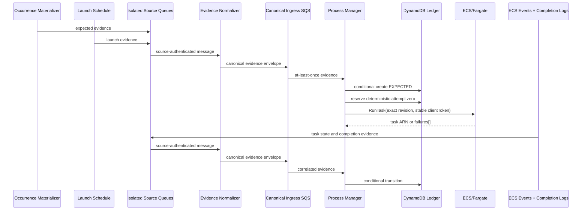

# ECS Scheduled Jobs Platform Service — Solution Design Review

## 1. Executive Review Gate

This document supports platform, security, IAM, application, and operations approval. [ARCHITECTURE-SPINE.md](ARCHITECTURE-SPINE.md) is the binding implementation contract.

Reviewers must:

1. Ratify the adopted PRD variance for the account-local Cell, brokered launch, and internal durability queues, then update the PRD/addendum.
2. Approve the schedule-expression conformance suite as production missed-run acceptance evidence.
3. Confirm GitHub immutable/custom OIDC subjects and protected-Environment controls.
4. Confirm retention defaults: 90-day production logs and occurrences, 30-day non-production logs, 35-day ledger point-in-time recovery (PITR), and 14-day queues.
5. Confirm the pilot account, Region, jobs, owners, notification targets, operator controls, and measured Cell recovery point and recovery time objectives (RPO/RTO) before rollout.

## 2. Decision Summary

The solution uses an **account-local Cell-based architecture with an event-driven Process Manager**. Each AWS Account-Region pair contains one shared Platform Cell. Application repositories consume a per-job Terraform module that creates the ECS task definition, one EventBridge Scheduler launch schedule, job-scoped IAM roles, log group, alarms, and an immutable job configuration (`CONFIG`) record.

An independent Occurrence Materializer creates each `EXPECTED` occurrence at least 24 hours ahead. Scheduler later emits `LAUNCH` evidence. Policy-isolated queues and a Cell normalizer authenticate evidence before one Process Manager owns state and launches ECS under a job-scoped role. ECS events and structured logs complete the occurrence record; a transactional outbox provides reliable alert delivery.

## 3. Why This Shape

| Option | Benefit | Decision |
| --- | --- | --- |
| Direct Scheduler to ECS | Smallest resource graph | Rejected: does not independently materialize expectations or let the platform reliably process HTTP-200 `RunTask` responses containing `failures[]` |
| Step Functions | Explicit lifecycle and timeout orchestration | Rejected: introduces orchestration excluded from MVP and changes the consumer model |
| Materializer + SQS + Process Manager + DynamoDB | Replayable evidence, one state owner, idempotent launch, per-occurrence deadlines | Selected: keeps jobs on ECS Fargate and deploys shared controls once per account and Region |

### Product Contract Variances

This architecture adopts a controlled variance from the finalized PRD's direct Scheduler-to-ECS target and Scheduler `ecs:RunTask` role language. Scheduler instead sends a launch envelope to the Cell, and the Process Manager assumes a job-scoped launch role. The shared Cell and its internal SQS redrive and Scheduler dead-letter queues (DLQs) are required internal MVP components; consumer-configurable payload DLQs remain deferred. The PRD and addendum must be reconciled with this adopted architecture before implementation stories are baselined.

## 4. Component Responsibilities

| Component | Owner | Responsibility | Must not do |
| --- | --- | --- | --- |
| Platform Cell Terraform module | Platform Engineering | Shared queue, DLQs, Lambdas, ledger, event rules, cell alarms, SSM Cell Contract | Create application task definitions or task permissions |
| Scheduled Job Terraform module | Application team (through the platform contract) | Task definition, launch schedule, log group/subscription, job alarms, workload/launch roles, CONFIG inbox object | Create shared processors, write Cell tables, or read platform Terraform state |
| Occurrence Materializer | Platform Engineering | Evaluate active immutable schedule generations and emit future expected occurrences | Launch tasks or mutate occurrence state |
| EventBridge Scheduler | Platform contract | Emit launch evidence with the canonical scheduled time | Call ECS directly or create expectations |
| Evidence normalizer | Platform Engineering | Bind queue ARN and immutable sender/role identity to registered producer, job, and generation | Accept caller-stamped identity or authorize commands |
| Process Manager | Platform Engineering | Validate envelopes, own occurrence transitions, assume launch role, call `RunTask`, emit state metrics | Trust launch parameters from messages or mutate CONFIG |
| Log ingestor | Platform Engineering | Parse approved structured completion records and emit normalized evidence | Declare success or write the ledger |
| Deadline scanner | Platform Engineering | Query due occurrences and emit deadline evidence | Stop tasks or choose final state |
| Alert Router | Platform Engineering | Publish occurrence-alert events and aggregate alarm events to notification targets | Become the authoritative incident system |
| Command handler | Platform Engineering | Authorize and stamp rerun, replay, disablement, and recovery commands | Accept caller-supplied occurrence IDs or arbitrary evidence |
| Application container | Job Owner | Perform work, use idempotency or locking, and emit occurrence-aware start, success, and failure logs | Generate its own Occurrence ID or claim success without the supplied ID |

Every integration edge has one Terraform owner. The checked-in Compatibility Package defines each cross-root ARN, permission, and lifecycle handoff.

## 5. Occurrence Contract

### Identity

The immutable schedule contract contains expression, time zone, explicit start anchor, activation window, and schedule-generation hash. Identity version `occurrence/v1` hashes exact UTF-8 bytes containing canonical job ID, schedule generation, and Unix epoch minute; event schema versions never affect identity. Materializer and Scheduler outputs must converge on published identity vectors, with conformance tests covering cron/rate grammar, time zones, daylight-saving boundaries, and consecutive windows. The Process Manager recomputes and rejects a supplied mismatch.

MVP permits exactly one platform ECS task attempt per scheduled or synthetic occurrence. Before launch, the Process Manager transactionally reserves attempt zero, the exact CONFIG version, a deterministic client token, the first-request time, and a conservative retry deadline within one hour of that request. Retries first reconcile by cluster, Cell tags, and `startedBy=occurrence_id`. The ECS token TTL is the shorter of 24 hours and one hour beyond the resource lifetime. Therefore, the system does not call `RunTask` for an unresolved retry or replay after the conservative deadline. Unresolved launch, parameter mismatch, multiple task ARNs, or token conflict becomes `AMBIGUOUS` and requires an authorized synthetic rerun.

### Configuration

Terraform publishes secret-free, content-addressed CONFIG to the job's exact prefix in a Cell-owned, encrypted, versioned S3 inbox. The materializer validates its schema and hash, then copies an immutable snapshot into a configuration-registry table physically separate from the runtime ledger. Job apply roles have no table write permission. CONFIG includes the full task-definition ARN with revision, cluster, subnets, security groups, roles, runtime deadline, log group, and notification metadata. The Process Manager recomputes the canonical body hash before use. Production launch remains disabled until registry acknowledgement and expectation-horizon verification.

### State

The state machine distinguishes expected, started, succeeded, failed, overdue, missed, and ambiguous. Checked-in transition fixtures verify that every bounded permutation of immutable, deduplicated evidence reduces to the same result. A launch may repair a missing expectation only when CONFIG proves that occurrence, and the repair emits a Cell-defect signal. A successful completion requires both a zero essential-container exit and exactly one valid structured success marker for attempt zero. Late, duplicate, or conflicting evidence cannot overwrite a terminal result.

The Process Manager supplies reserved job, occurrence, CONFIG, and attempt values as ECS task tags and container environment overrides and indexes the returned task ARN. ECS identity derives from AWS event resource/detail fields and the task-ARN ledger index. Completion-log identity derives from the AWS-generated subscription log-group/stream envelope mapped to that job/task. IDs in application log text are assertions to validate, not authoritative identity. Early events remain orphan evidence until their launch mapping is recorded.

Manual reruns are separately authorized synthetic occurrences linked through `replay_of_occurrence_id`. A trusted command handler generates a UUIDv7 command ID and hashes a separate `occurrence/manual/v1` identity domain containing job, original occurrence, CONFIG, and command ID. It records actor, approval, reason, reviewed Deployment Identity, verification, and compensation acknowledgement. Users cannot supply occurrence IDs or arbitrary evidence.

## 6. Failure Coverage

| Failure | Detection | Result |
| --- | --- | --- |
| Materializer stops advancing expectation horizon | Horizon freshness alarm before exhaustion | Cell-wide Platform incident |
| Scheduler target delivery failure | Scheduler retry metrics and Scheduler DLQ | Expected occurrence becomes `MISSED`; enriched alert |
| Launch signal absent but expectation present | Deadline scanner | `MISSED` |
| `RunTask` HTTP error or non-empty `failures[]` | Process Manager response handling | `FAILED` |
| Process Manager crash after successful launch | SQS retry plus `RunTask.clientToken` | Original task returned; no second launch |
| Launch evidence replayed after safe retry deadline | Attempt age gate and task reconciliation | No `RunTask`; `AMBIGUOUS` plus operator review |
| ECS task fails to start | Durable ECS task-state event | `FAILED` |
| Essential container exits nonzero | ECS task-state event | `FAILED` |
| Success marker without zero exit | State-machine correlation | Remains non-success; eventually `OVERDUE` or `FAILED` |
| Zero exit without success marker | Deadline scanner | `OVERDUE` |
| Multiple task ARNs or conflicting completion | Deterministic evidence reducer | `AMBIGUOUS` |
| Poison message received by the Process Manager | Partial batch response, ingress retry, Cell DLQ | Quarantine and Cell alarm |
| Entire Scheduler path stops emitting | Independent expectations expire plus Cell canary | Per-job misses and Cell-wide incident |

The materializer is invoked by an EventBridge scheduled rule rather than EventBridge Scheduler and always maintains at least a 24-hour expectation horizon. Its health check fails before that horizon can exhaust. The deadline scanner uses a durable watermark, bounded lookback, base-table verification, and repeated reconciliation so eventual GSI propagation cannot permanently skip a deadline. This separation makes a Scheduler-wide launch outage observable per occurrence; it does not promise independence from a Region-wide EventBridge or AWS control-plane outage.

## 7. Security and IAM Review

### Runtime Roles

| Role | Trust | Allowed authority |
| --- | --- | --- |
| Scheduler delivery role | `scheduler.amazonaws.com`, restricted by source account and schedule-group ARN | Send only to Scheduler source queue and DLQ |
| Materializer role | Lambda service | Read active CONFIG and send only to expectation source queue; no occurrence write or ECS launch |
| Evidence normalizer role | Lambda service | Read isolated source queues, stamp registered producer identity, write canonical ingress |
| Process Manager role | Lambda service | Read canonical ingress/CONFIG, conditionally write runtime/outbox items, publish bounded metrics, assume job launch roles |
| Command handler role | Lambda service | Authorize registered job operations and emit Cell-stamped commands |
| Job launch role | Exact Process Manager role | `RunTask` for one task-definition family on one cluster; `PassRole` for exact execution/task roles |
| ECS task execution role | ECS tasks service | Pull the image, write logs, resolve exact secret references |
| Application task role | ECS tasks service | Explicit application AWS permissions only |
| Terraform plan role | Exact GitHub OIDC subject | Read configuration/state and AWS resources required for plan; no infrastructure mutation |
| Terraform apply role | Exact production GitHub OIDC subject after Environment approval | Apply within platform permissions boundary and exact state path |

A permissions boundary is mandatory for every platform-created role. Negative tests prove that CI roles cannot create IAM users or keys, create administrator-equivalent policies, remove boundaries, alter their own trust, modify the GitHub OIDC provider, pass unrelated roles, write runtime ledger/registry records, write another job's CONFIG inbox prefix, or modify protected state controls.

Human responders never assume workload roles. A separate short-lived operator role grants bounded diagnosis, replay, rerun, schedule-disablement, and approved recovery actions. Production sessions require approval and are attributable to a specific actor in CloudTrail; break-glass use is time-bound, generates an alert, requires independent approval, and is reviewed.

### GitHub OIDC

GitHub repositories using immutable subjects include owner and repository IDs in the `sub` claim. The organization customizes `sub` to include deployment Environment and `job_workflow_ref`; AWS matches the exact `aud = sts.amazonaws.com` and expected `sub`. This places reusable-workflow identity inside the `sub` claim that AWS can evaluate, rather than relying on a separate unsupported custom claim. The workflow reference is a full commit SHA.

GitHub plan capabilities remain a production prerequisite. Required reviewers, self-review prevention, restricted deployment refs, and disabled administrator bypass must be available or replaced with an equivalent auditable control before production authorization.

## 8. Networking and Data Protection

Platform Lambdas remain outside customer VPCs. They access SQS, DynamoDB, ECS, STS, CloudWatch, and SNS through AWS regional endpoints and have no inbound public interface. ECS tasks run with public IP assignment disabled in private subnets. A module-created security group has no ingress and only explicit security-group, prefix-list, or CIDR egress; unrestricted Internet egress is a blocking production exception. Consumers may instead supply validated security groups and either NAT egress or the endpoints required for ECR, S3, CloudWatch Logs, Secrets Manager/SSM, and workload dependencies.

SQS, DynamoDB, S3 state, and CloudWatch Logs use encryption at rest. Default service-managed encryption is acceptable for operational metadata unless organizational policy requires a customer-managed KMS key. Production DynamoDB enables 35-day point-in-time recovery. Terraform state uses an encrypted, versioned, public-blocked S3 backend with native S3 lock files and path-scoped IAM.

No secret value may appear in CONFIG, occurrence records, SQS messages, logs, Terraform variables, plans, or documentation. ECS-agent injection supports same-account Secrets Manager/SSM references through the execution role. Approved application-pull references, including an approved external secrets platform, use the task role and explicit network access. Cross-account or customer-managed KMS access requires validated resource/key policies.

## 9. Observability and Operations

### Required Signals

- Expectation-horizon depth/freshness and schedule-evaluator conformance failures.
- Scheduler invocation attempts, target errors, throttles, dropped invocations, and Scheduler DLQ depth.
- Ingress queue age/depth, Cell DLQ depth, Process Manager errors/throttles/duration, and deadline-scanner lag.
- Occurrence transitions for failed, missed, overdue, and ambiguous states.
- ECS task start failures, stop code/reason, essential-container exit code, and completion-marker validity.
- Log subscription delivery errors and disabled-filter conditions.
- Processed heartbeat from the Cell canary.

Occurrence ID is never a CloudWatch metric dimension. Alarms use bounded job, Environment, and state dimensions for sustained health. The Process Manager atomically commits terminal state and a unique alert-outbox record. DynamoDB Streams and a reconciliation scan drive the Alert Router, which deduplicates against a separate notification ledger and publishes job, Occurrence ID, state, failure plane, account, Region, Deployment Identity, and Runbook link.

Production acceptance testing injects every required failure and must detect it within five minutes of the observable failure or deadline, with zero false alerts across at least 20 accelerated successful windows. Cell-wide failures page Platform on-call once per Cell incident. Consecutive occurrence failures each notify the Job Owner even while aggregate alarms remain in `ALARM`.

## 10. Terraform and Delivery

The platform and job modules have separate root states. The Cell publishes a JSON-Schema-validated SSM contract at `/platform/ecs-scheduled-jobs/<environment>/<region>/contract`, containing Cell/account/Region identity, semantic version, exact ARNs, supported schema/config ranges, metric namespace, KMS reference, and checksum. Consumers validate identity and compatibility and do not use `terraform_remote_state` across repositories. A Platform-owned namespace registry authorizes each Environment/Application prefix. Before a job plan, the workflow binds the job ID to the repository, root, apply-role identity, account, Region, and owner. After phase one creates the IAM role and disabled schedule, the Registrar resolves and binds the role's immutable Role ID and the schedule ARN. Duplicate or unauthorized claims fail.

Pull requests run `terraform fmt -check`, initialization without backend access, validation, module tests, example checks, security scanning, IAM analysis, policy fixtures, and reviewed plan generation. Untrusted pull requests receive no AWS credentials. A trusted plan uses a read-only role. Production creates a fresh plan from the deployment commit, uploads the sensitive plan with short retention, waits at the protected Environment gate, and applies the exact plan with a separate role. Provider lock files are committed, and production initialization verifies them without modification. Production policy failures block; only the explicitly staged non-production checks named by the PRD may begin as advisory.

All roots and modules require Terraform `>= 1.10, < 2.0` because native S3 `use_lockfile` is mandatory. Version `1.15.8` is the dated validation seed, not a permanent patch constraint. The Compatibility Package is consumed by module and runtime CI and owns identity vectors, schemas, transition permutations, task correlation, IAM edges, queue/Lambda bounds, metrics/alerts, OIDC rendering, and the Cell/job compatibility matrix.

Schedule expression or time-zone changes require two applies: disable launch and retire/drain the old generation, then publish the new generation with a future activation anchor, verify its materialized expectation horizon, and enable Scheduler at that same anchor. This makes a possible gap explicit rather than allowing Scheduler and the materializer to disagree.

Initial creation and launch-relevant changes use `RESERVED`, `PUBLISHED`, `VALIDATED`, `MATERIALIZED`, `ENABLED`, and `REJECTED` states. Reservation precedes planning. Phase one publishes CONFIG and creates the role plus schedule disabled at a future activation anchor. The Cell acknowledgement binds their actual AWS identities and records ownership generation, config hash, contract/schema versions, validation, and horizon watermark. A separately reviewed phase-two plan can enable only that acknowledged generation; Terraform preconditions and blocking policy enforce the handshake.

## 11. Rollout and Rollback

1. Deploy one disposable non-production Cell and run contract, IAM-negative, state-machine, and failure-injection tests.
2. Deploy one or two low-risk pilot jobs with named Job Owners and completed Runbooks.
3. Validate schedule-evaluator conformance, expectation-horizon independence, Scheduler delivery, `RunTask` response failures, task-state events, completion correlation, deadlines, alert enrichment, and Cell-canary behavior.
4. Rehearse Cell rollback, job-module rollback, queue replay, schedule disablement, and task-definition restoration.
5. Promote the tested immutable Cell/module/workflow versions to production after platform, application, and required Security approval.

Rollback disables launch first, retires the affected generation, drains or quarantines in-flight evidence, restores a known-good Deployment Identity and compatible runtime/module/schema versions, replays safe messages, and verifies scheduling, execution, logs, state transitions, and alarms within the job's recovery-time objective. CONFIG items, prior task definitions, Lambda versions, evidence, and logs remain available through the longest applicable compatibility, retry, or runtime horizon. Before destructive cleanup, the Job Owner must run the tested procedure for compensating application data side effects.

Cell upgrades use expand/migrate/contract sequencing and a stable Process Manager principal within a major. The current and previous major remain compatible through the maximum queue/replay/rollback horizon. A Cell lifecycle principal alone garbage-collects CONFIG and task-definition versions after proving them unreferenced. Cell recovery disables launch, restores PITR to new tables, switches versioned processor aliases and contract pointers, replays post-restore evidence, rebuilds expectations, reconciles nonterminal occurrences, and verifies alerts before resuming.

## 12. Risks and Approval Conditions

| Risk | Control | Approval condition |
| --- | --- | --- |
| Materializer evaluates a schedule differently from Scheduler | Shared normalized contract, conformance fixtures, horizon/launch mismatch alarm | Platform approves the supported expression subset and DST fixtures |
| Scheduler-wide launch outage | Independently materialized expectations, deadline state, canary | SRE verifies per-occurrence missed alerts during failure injection |
| Schedule generation is partially updated | Immutable generation and two-apply production change | Runbook and integration test prove retire/materialize/enable flow |
| Shared Process Manager becomes broad authority | Per-job AssumeRole, inbox/registry/ledger separation, verified CONFIG, negative IAM tests | Security approves trust, boundary, data-store denies, and PassRole policies |
| At-least-once events create duplicate state or tasks | Attempt-zero reservation, event dedupe, stable ECS client token | Failure tests prove crash-window idempotency |
| Producer forges another job or evidence type | Isolated queues and source-specific AWS metadata mapped to registered ownership | Negative fixtures reject forged schedule, log, task, replay, and cross-job claims |
| Terminal state commits but alert publish crashes | Transactional outbox, Stream dispatch, reconciliation, dedupe ledger | Failure tests prove no stranded alert across crash points |
| Two roots claim one job ID | Conditional Cell registration bound to immutable repository/apply identity | Simultaneous-claim and transfer tests pass |
| Repository squats another application namespace | Platform-owned prefix authorization and independent approval | Cross-namespace, stale-role, and repository-transfer tests pass |
| Logs are delayed, duplicated, or dropped | ECS event correlation, deadline state, subscription alarms | Completion tests cover late, duplicate, and absent markers |
| GitHub controls cannot bind production workflow | Immutable/custom OIDC subject and protected Environment | GitHub plan/configuration verified before production |
| Shared Cell change affects all jobs in an account/Region | Versioned Lambda aliases, pilot Cell, bounded rollout, rollback | Cell change-failure test and rollback rehearsal pass |

## Appendix A: Verified Sources

- [AWS EventBridge Scheduler context attributes](https://docs.aws.amazon.com/scheduler/latest/UserGuide/managing-schedule-context-attributes.html)
- [AWS EventBridge Scheduler dead-letter queues](https://docs.aws.amazon.com/scheduler/latest/UserGuide/configuring-schedule-dlq.html)
- [AWS ECS RunTask idempotency](https://docs.aws.amazon.com/AmazonECS/latest/developerguide/ECS_Idempotency.html)
- [AWS ECS task-state events](https://docs.aws.amazon.com/AmazonECS/latest/developerguide/ecs_task_events.html)
- [AWS ECS events are durable in EventBridge](https://docs.aws.amazon.com/eventbridge/latest/ref/events-ref-ecs.html)
- [AWS Lambda with SQS](https://docs.aws.amazon.com/lambda/latest/dg/with-sqs.html)
- [AWS Lambda SQS partial-batch failure handling](https://docs.aws.amazon.com/lambda/latest/dg/services-sqs-errorhandling.html)
- [AWS CloudWatch Logs subscriptions](https://docs.aws.amazon.com/AmazonCloudWatch/latest/logs/Subscriptions.html)
- [AWS DynamoDB conditional writes](https://docs.aws.amazon.com/amazondynamodb/latest/developerguide/WorkingWithItems.html)
- [AWS DynamoDB point-in-time recovery](https://docs.aws.amazon.com/amazondynamodb/latest/developerguide/Backup-and-Restore.html)
- [AWS DynamoDB GSI consistency](https://docs.aws.amazon.com/amazondynamodb/latest/developerguide/GSI.html)
- [AWS CloudWatch alarm action behavior](https://docs.aws.amazon.com/AmazonCloudWatch/latest/monitoring/alarm-actions.html)
- [AWS Lambda SQS event-source configuration](https://docs.aws.amazon.com/lambda/latest/dg/services-sqs-configure.html)
- [HashiCorp S3 backend and native lock files](https://developer.hashicorp.com/terraform/language/backend/s3)
- [HashiCorp Terraform 1.10 release](https://github.com/hashicorp/terraform/releases/tag/v1.10.0)
- [HashiCorp Terraform dependency locks](https://developer.hashicorp.com/terraform/language/files/dependency-lock)
- [GitHub OIDC reference and immutable subjects](https://docs.github.com/en/actions/reference/security/oidc)
- [GitHub deployment Environments](https://docs.github.com/en/actions/reference/workflows-and-actions/deployments-and-environments)
