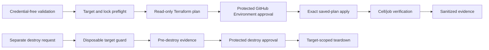

# Deployment Contract

This companion carries the detailed rules behind `SPEC-ecs-scheduled-jobs-platform-deployment`.

## Ownership and order

- The Platform Cell root owns shared queues, ledgers, processors, alarms, recovery resources, Cell Contract publication, and Cell IAM.
- The scheduled-job root owns the task definition, job roles, schedule, CONFIG publication, log group, job alarms, dashboard, and optional job security group.
- The Cell root is applied and verified before the job root. The job root consumes the published Cell Contract and never reads the Cell Terraform state.
- Phase one publishes/configures resources with launch disabled. Phase two enables only the exact acknowledged generation after validation and materialization.

## Target binding

The deployment workflow must consume an immutable target manifest binding:

- repository and immutable source/workflow identity;
- GitHub Environment and approved reviewers;
- `disposable_nonproduction` status;
- AWS Account and Region;
- Cell and job Terraform roots;
- encrypted backend bucket, state key, and lock path;
- plan/apply role identities;
- Cell identity and contract compatibility;
- approved ECR image digest and network boundary.

Operator inputs may select a reviewed manifest, but may not override its Account, Region, role, backend, root, Cell, or Environment.

## Workflow sequence

The apply stage cannot replan, refresh-only apply, substitute variables, change targets, or automatically retry mutation. Failed mutation requires state/lock inspection and a new plan.

## Configuration and secrets

GitHub Environment configuration contains non-secret selectors, target metadata, approval controls, and bounded workflow settings. Infisical is accessed only by an authorized workflow step using GitHub OIDC and a scoped machine identity. Secret values are masked and ephemeral; they are never written to Terraform files, plans, state, artifacts, summaries, logs, CONFIG, or deployment evidence.

Durable workload secrets are represented by approved AWS secret-provider locators. Terraform and the job receive references and permissions, not secret values. Missing or unauthorized secret retrieval fails before mutation or leaves launch disabled.

## Verification evidence

The deploy workflow verifies Cell Contract publication, target identity, schedule state/generation, task-definition and image identity, launch response including failure entries, ECS task state, structured completion, CloudWatch Logs, alarms, retry behavior, and DLQ behavior. Evidence is sanitized and bounded.

The destroy workflow records deployment and verification evidence before teardown, validates the target is disposable, rejects production/shared Cell/protected state/retained evidence, and reports partial failure without broad cleanup.

## Required implementation controls

- Terraform `fmt`, locked initialization, validation, policy/security scans, and repository hygiene before mutation.
- Full-SHA action and workflow references; immutable image and module/provider inputs.
- OIDC trust restricted by exact audience, repository identity, workflow/deployment context, and protected Environment.
- Separate plan, apply, operator, Scheduler, Process Manager, execution, task, and Infisical machine identities.
- Explicit resource tags: `Environment`, `Application`, `Service`, `Owner`, `ManagedBy`, plus applicable `CostCenter` and `Repository`.
- Explicit log retention, alarms, retry age/attempt bounds, DLQs, runbook links, and rollback/fresh-plan guidance.
